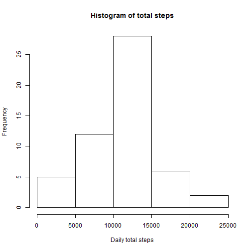
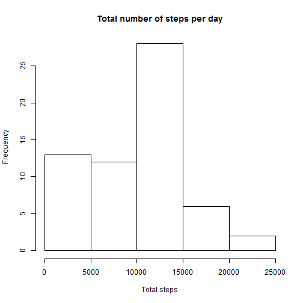
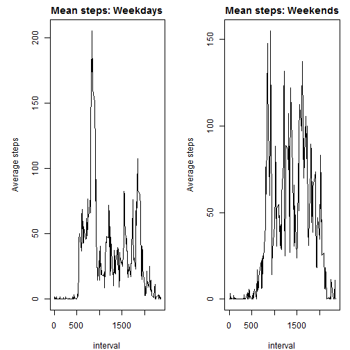

This is **Assignment 1** of *Reproducible Research*. 
The entire R markdown file is meant to be self explanatory.

## Default options

*The following options are introduced in accordance with the assignment instruction.*


```r
#   Default Options not displayed...
#
#     echo = TRUE
#     LANG = "en_US.UTF-8"
```

*In addition, the following takes care of printing weekdays in English.*


```r
Sys.setlocale("LC_TIME", "English")
```

*Nececessay libraries are included.*


```r
library ( dplyr )
```

## Preliminry steps

**Read the data from file**

**df0** *will be the dataframe from the original data*.
**df1** *will be the dataframe with missing data ommitted.*


```r
df0 <- read.csv ( "activity.csv" )
df1 <- na.omit ( df0 )
```

## A. What is mean total number of steps taken per day?

### 1. Calculate the total number of steps taken per day

```r
df21 <- group_by ( df1 , date )
df22 <- summarize ( df21 , total_steps = sum ( steps ) , avg_steps = mean ( steps ) )
```

### 2. Make a histogram of the total number of steps taken each day


```r
hist ( df22$total_steps , main = "Histogram of total steps" , xlab = "Daily total steps")
```

 


### 3. Calculate and report the mean and median of the total number of steps taken per day


```r
mean22 <- mean(df22$total_steps)
median22 <- median(df22$total_steps)
```

**Mean**


```r
print ( mean22 )
```

```
## [1] 10766.19
```

**Median**


```r
print ( median22 )
```

```
## [1] 10765
```

## B. What is the average daily activity pattern?

### 1. Make a time series plot (i.e. type = "l") of the 5-minute interval (x-axis) and the average number of steps taken, averaged across all days (y-axis)

```r
df31 <- group_by ( df1 , interval )
df32 <- summarize( df31 , avg_steps = mean ( steps ) )
plot(df32 , type="l" , main = "Average number of steps")
```

 

### 2. Which 5-minute interval, on average across all the days in the dataset, contains the maximum number of steps?


```r
ind <- which.max ( df32$avg_steps )
print ( df32$interval [ ind ] )
```

```
## [1] 835
```

## C. Imputing missing values


### 1. Calculate and report the total number of missing values in the dataset.

*An auxilliary function for figuring out rows with missing data.*


```r
f <- function ( a ) 
{ 
  if ( sum ( is.na ( a ) ) > 0 )
  {
    return (TRUE)
  }
  return (FALSE)
}
```

*List of indices of missing values~*


```r
na_list <- which ( apply ( df0 , 1 , f ) )
```

**the total number of missing values**


```r
length ( na_list )
```

```
## [1] 2304
```

### 2. Devise a strategy for filling in all of the missing values in the dataset. The strategy does not need to be sophisticated.

**Strategy**

* Replace NA in steps by average steps of the day if available.
* Otherwise, it will be replaced by median across days...

### 3. Create a new dataset that is equal to the original dataset but with the missing data filled in.

*An auxiliry step...* 


```r
df41 <- group_by ( df1 , interval )

df42 <- summarize ( df41 , median_steps = median ( steps ) )

g <- function ( m )
{
  a <- which ( df22$date == df0$date [ m ] )
  
  if ( length ( a ) > 0)
  {
    return ( df22$avg_steps [ a ] )
  }

  a <- which ( df42$interval == df0$interval [ m ] )
  
  if ( length ( a ) > 0 )
  {
    return ( df42$median_steps [ a ] )
  }
  
  print ("Missing data cannot be filled with our algorithm! I give up...")
  stop()
}
```

*New dataframe*


```r
df90 <- df0

for ( k in na_list )
{
  df90$steps [ k ] <- g ( k )
}
```

### 4.Make a histogram of the total number of steps taken each day and Calculate and report the mean and median total number of steps taken per day. Do these values differ from the estimates from the first part of the assignment? What is the impact of imputing missing data on the estimates of the total daily number of steps?


```r
df91 <- group_by ( df90 , date )
df92 <- summarize( df91 , total_steps = sum ( steps ) )
hist ( df92$total_steps , main = "Total number of steps per day" , xlab = "Total steps")
```

 

```r
mean92 <- mean ( df92$total_steps )
median92 <- median ( df92$total_steps )
```

**mean with missing data replaced vs. mean with original data set**


```r
print ( mean92 ) # mean with missing data replaced
```

```
## [1] 9503.869
```

```r
print ( mean22 ) # mean with original data set
```

```
## [1] 10766.19
```

**median with missing data replaced vs. median with original data set**


```r
print ( median92 ) # median with missing data replaced
```

```
## [1] 10395
```

```r
print ( median22 ) # median with original data set
```

```
## [1] 10765
```

**Impact of imputing NA values**

* The mean and median gets lower even though we are dealing with total steps, since there were dates without total steps and the newly added data contribute less than other good data...

## D. Are there differences in activity patterns between weekdays and weekends?

### 1. Create a new factor variable in the dataset with two levels – “weekday” and “weekend” indicating whether a given date is a weekday or weekend day.

*An auxilliary function and its vectorized version~*


```r
h1 <- function ( d )
{
  a <- weekdays ( as.Date ( d ) , abbreviate = TRUE )
  if ( a == "Mon" | a == "Tue" | a == "Wed" | a == "Thu" | a == "Fri" )
  {
    return ( "weekday" )
  }
  
  return ("weekend")
}

h <- Vectorize ( h1 )
```

*Extra factor variable weekday introduced in the data set.*


```r
df80 <- transform ( df90 , weekday = h ( date ) )
df81 <- group_by ( df80 , weekday )
```

**Summarized**


```r
summarize ( df81 , mean_steps = mean ( steps )  )
```

```
## Source: local data frame [2 x 2]
## 
##   weekday mean_steps
## 1 weekday   31.15448
## 2 weekend   38.18880
```

**Conclusion**

There seems to be a significant difference.

### 2. Make a panel plot containing a time series plot (i.e. type = "l") of the 5-minute interval (x-axis) and the average number of steps taken, averaged across all weekday days or weekend days (y-axis).


```r
df70 <- filter ( df81 , weekday == "weekday" )
df60 <- filter ( df81 , weekday == "weekend" )
df71 <- group_by ( df70 , interval )
df61 <- group_by ( df60 , interval )

df72 <- summarize (df71 , avg_steps = mean ( steps ) )
df62 <- summarize (df61 , avg_steps = mean ( steps ) )

par(mfrow = c(1, 2), mar = c(4, 5, 2, 1))

plot ( df72 , type = "l" , main = "Mean steps: Weekdays" , ylab = "Average steps" )
plot ( df62 , type = "l" , main = "Mean steps: Weekends" , ylab = "Average steps" )
```

 
